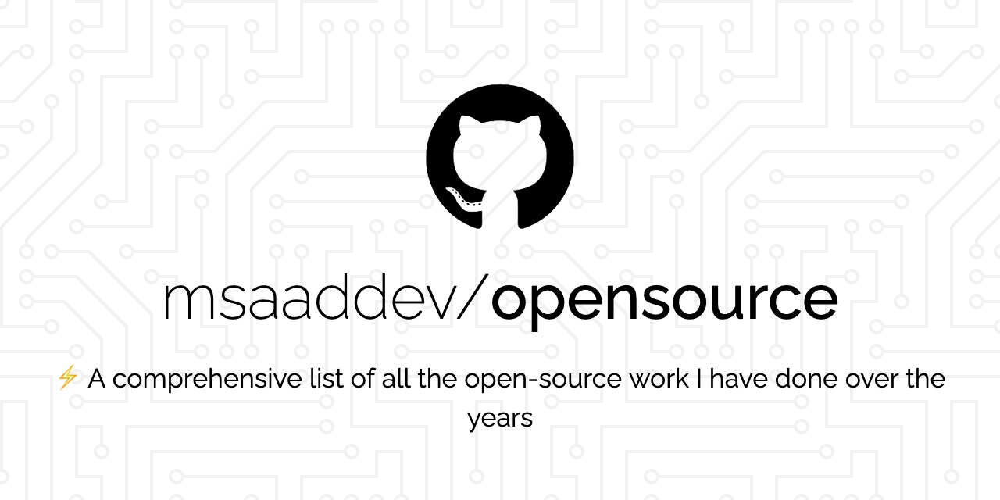

	
	
	

## Table of Content
- [Automation Tools](#automation-tools)
- [Packages](#packages)
- [Web Apps](#web-apps)
- [Guides](#guides)
- [Contributions](#contributions)
	- [Organizations](#organizations)
- [Talks](#talks)
- [Others](#others)
- [License & Conduct](#license--conduct)

## Automation Tools

- [new-tailwind-app](https://github.com/msaaddev/new-tailwind-app) - A zero-configuration automation tool that supports integration of Tailwind CSS with six different web frameworks/libraries.
- [create-next-pwa](https://github.com/msaaddev/create-next-pwa) - A nodejs command-line tool to instantly set up Progressive Web App with Next.js.
- [create-foss-files](https://github.com/msaaddev/create-foss-files) - Get all the files you need to get started with the development of an open-source software.
- [stackoverflow-cli](https://github.com/msaaddev/stackoverflow-cli) - Interact with StackOverflow without leaving your code-editor.
- [docx-to-markdown](https://github.com/msaaddev/docx-to-markdown) - Convert all your Micrsoft Word files to Markdown with a single command.
- [password-gen-cli](https://github.com/msaaddev/password-gen-cli) - Instantly generate random strong passwords.
- [github-interact-cli](https://github.com/msaaddev/github-interact-cli) - Eliminate the grunt work of repo creation, opening issues, etc and perform all those actions from your terminal.
- [geo-location-cli](https://github.com/msaaddev/geo-location-cli) - Decode all the information that is encrypted in an IP address.
- [who-unfollowed-me](https://github.com/msaaddev/who-unfollowed-me) - A CLI that lets you know who has recently unfollowed you on GitHub.
- [.gitignore](https://github.com/msaaddev/gitignore) - Quickly generate a `.gitignore` file in your project.

## Packages

- [node-async-exec](https://github.com/msaaddev/node-async-exec) - A package that runs exec command asynchronously and also changes directory if needed to run commands.
- [cross-paths](https://github.com/msaaddev/cross-paths) - A simple path conversion package to convert your paths across different platform.
- [exit-cli](https://github.com/msaaddev/exit-cli) - A nice way to exit your command-line tools. Also, let the user know if an update is available for your CLI.

## Web Apps

- [Jobboard](https://github.com/msaaddev/jobboard) - A Next.js + Firebase PWA developed to get you hired.
- [TTable](https://github.com/msaaddev/TTable) - A MERN stack application that can take care of all your university scheduling needs.
- [GeoWeather](https://github.com/msaaddev/nextjs-weather-pwa) - A Next Weather Progressive Web App (PWA).
- [COVID-19-STAT](https://github.com/msaaddev/COVID-19-STAT) - A Jamstack web app to keep you updated with coronavirus statistics.
- [Shortify](https://github.com/msaaddev/Shortify) - A React.js frontend & Flask backend web app that uses Machine Learning to generate summary of an article.
- [Notelify](https://github.com/msaaddev/Notelify) - A quick way to manage your notes on the Internet.
- [AKS Trivia](https://github.com/msaaddev/aks-trivia) - A fun game website that asks you questions and you have 30 seconds to answer it.
- [f-login-template](https://github.com/msaaddev/f-login-template) - A sign in with Facebook authentication template that you can use in your product.

## Guides

- [git-commands-workflows](https://github.com/msaaddev/git-commands-workflows) - All the git commands and workflows you need to know to become proficient with git.
- [Writing npm packages](https://dev.to/msaaddev/hitchhiker-s-guide-to-writing-your-first-open-source-software-dh0) - A Hitchhiker's Guide To Writing Your First Open-source software.
- [Open-source Project files](https://dev.to/msaaddev/files-every-open-source-project-must-have-2mmm) - A piece on all the files you should have in your open-source project.
- [Prettier VSCode Extension](https://dev.to/msaaddev/make-your-code-look-pretty-prettier-591g) - A guide on how to set up prettier in your VSCode.
- [csharp-runner](https://github.com/msaaddev/csharp-runner) - A step-by-step guide to run C# in your VSCode.

## Contributions

### Organizations

- [Node.js](https://github.com/nodejs/outreach/pulls?q=is%3Apr+msaaddev+is%3Aclosed) - Curated the content for the new community page of Node.js foundation.
- [Directus](https://github.com/directus/directus/pulls?q=is%3Apr+is%3Aopen+msaaddev) - Added some features related to CLI updation.
- [NiftyCo](https://github.com/aniftyco/awesome-tailwindcss/pulls?q=is%3Apr+is%3Aopen+msaaddev) - New Tailwind resource
- [Open Observatory of Network Interference](https://github.com/ooni/explorer/pulls?q=is%3Apr+is%3Aopen+msaaddev) - Fixed some bugs and introduced a new feature.
- [Global Public Inclusive Infrastructure](https://github.com/GPII/gpii-chrome-extension/pulls?q=is%3Apr+is%3Aopen+msaaddev) - Improved documentation and code.
- [Google Developer Students Club UET Chapter](https://github.com/dscuet) – Set up documentation website and chapter website for Google DSC UET.

## Talks

- [NUST HackClub Session](https://github.com/msaaddev/hackclub-session) - Repo for the talk I delivered on building automation tool with Node.js.
- [Microsoft Community Islamabad](https://github.com/msaaddev/mlsa_session) - Repo for the talk I delivered on building automation tool with Node.js.
- [REST API Session](https://github.com/msaaddev/rest-api-session) - Repo for the talk I delivered on the working of REST APIs.

## Others

- [RetroMania](https://github.com/msaaddev/RetroMania) - A cross-platform desktop 2D game developed with GDScripts and Godot Engine.
- [Cross Zoom](https://github.com/msaaddev/Cross-Zoom) - A browser extension to zoom in and out to a particular percentage.

## License & Conduct

- MIT © [Saad Irfan](https://github.com/msaaddev)
- [Code of Conduct](https://github.com/msaaddev/opensource/blob/master/code-of-conduct.md)

